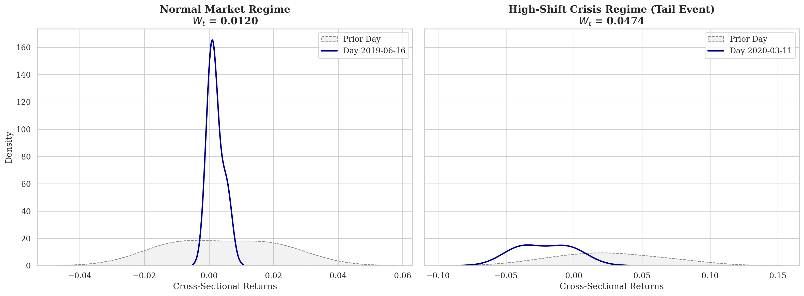
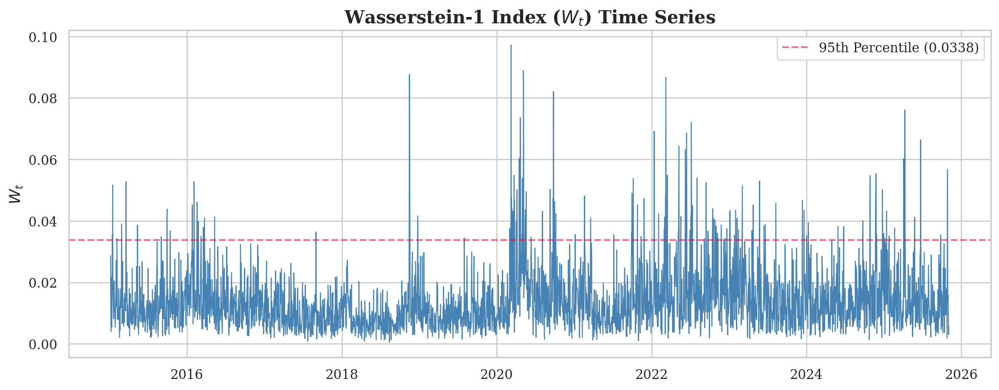
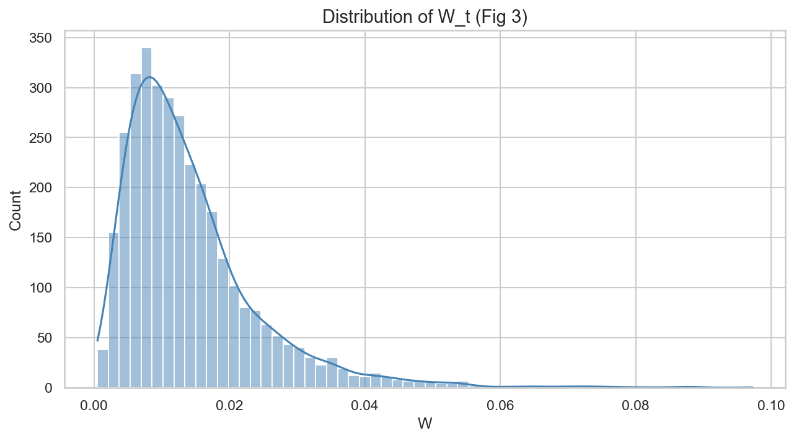
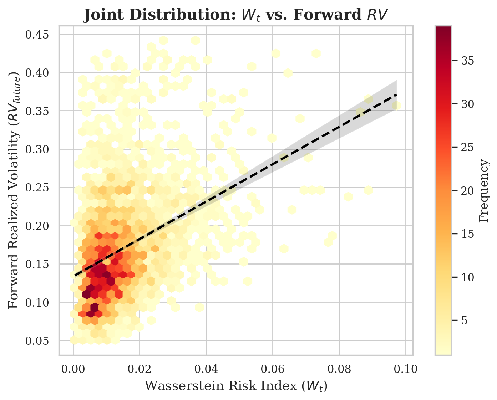
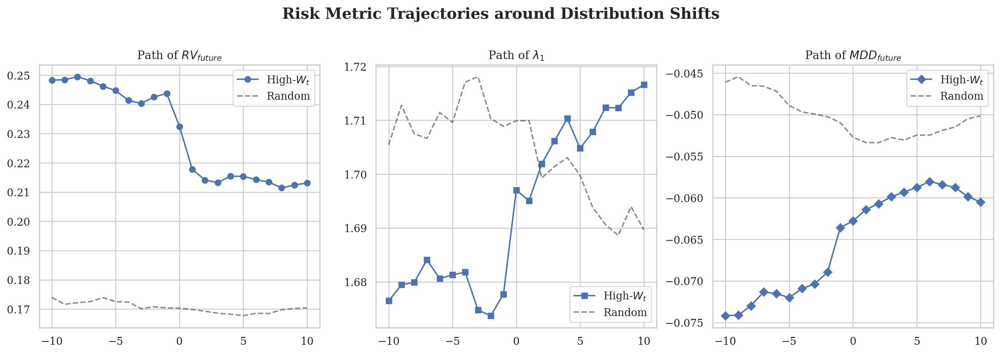
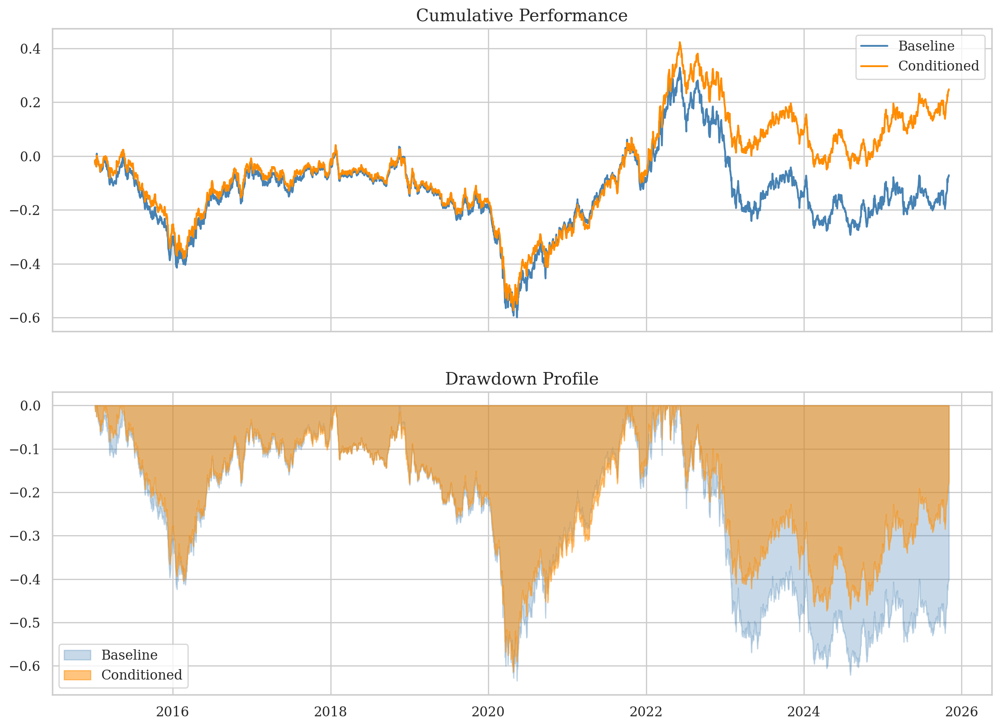
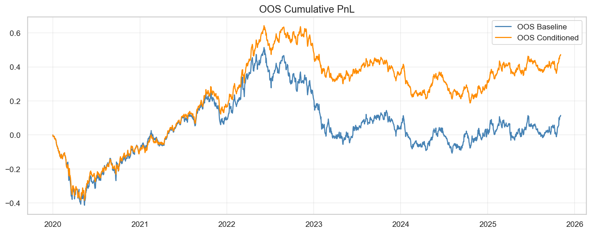
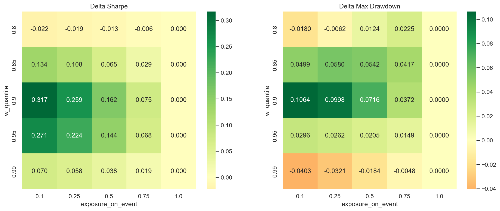

# Wasserstein Risk Index for Futures

**Optimal transport as a shock index — using the 1-Wasserstein distance between consecutive
cross-sectional return distributions to detect regime shifts and fragility in futures markets.**

<p align="left">
  
  
  
  
</p>

> Companion code to *“Optimal Transport as a Shock Index: Wasserstein Distance Framework
> for Regime & Fragility Detection in Futures.”* The pipeline computes a daily distribution-shift
> index $W_t$ across a basket of futures, links it to forward realized volatility and correlation
> structure, and uses it to condition a simple exposure-scaling strategy.

---

## At a glance

<p align="center">
  
</p>

<p align="center">
  <em>Calm versus crisis: on a calm day the cross-sectional return distribution barely moves
  ($W_t \approx 0.012$); on a high-shift day it dilates and translates ($W_t \approx 0.047$).
  $W_t$ measures exactly that movement.</em>
</p>

---

## Thesis

Standard risk indicators summarize **one moment** (variance) of **one series** (the index).
$W_t$ instead summarizes the **whole shape** of today’s cross-sectional return distribution
relative to yesterday’s. When the joint distribution dilates, translates, or fractures, $W_t$
spikes — and these spikes lead forward realized volatility, lift the dominant correlation
eigenvalue, and identify a regime in which a naive long carry strategy is at its most fragile.

## Method

For each trading day $t$, take the cross-section of log returns $r_t = \{r_{i,t}\}_{i \in U}$
over the futures universe $U$. The **Wasserstein risk index** is the 1D 1-Wasserstein distance
between consecutive days’ empirical distributions:

$$
W_t = W_1(\hat F_{t-1}, \hat F_t) = \int_0^1 \big| F_{t-1}^{-1}(u) - F_t^{-1}(u) \big| \, du
$$

Implemented with `scipy.stats.wasserstein_distance`. With equal weights, this reduces to the
mean absolute difference between the sorted return vectors of consecutive days — cheap, robust
to outliers in moments, and sensitive to changes the variance misses (skew, bimodality,
co-movement breaks).

Around $W_t$ we build:

- **Forward realized volatility** $RV_{\text{future}}$ on the equal-weight market return.
- **Largest correlation eigenvalue** $\lambda_1$ from a rolling cross-sectional correlation matrix
  (proxy for systemic co-movement).
- **HAC-OLS regressions** of $RV_{\text{future}}$ on $W_t$, $RV_{\text{past}}$, $\lambda_1$.
- **Event studies** around days where $W_t$ crosses the 95th percentile.
- A **conditioned strategy** that halves exposure on event days, benchmarked against a
  baseline; tested both full-sample and in a strict **OOS split at 2020-01-01**.
- **Robustness**: drop-one-universe sensitivity, exclude-COVID window, quantile × exposure
  heatmap.

## Why optimal transport

Optimal transport gives a geometry on distributions that respects the cost of *moving mass*.
Two distributions can have the same variance but very different shapes (one symmetric, one
heavily skewed), or identical marginals but opposing tail behavior. KL/JS distances explode
or vanish on disjoint support; $W_1$ degrades gracefully and has a clear interpretation:
"the average move you'd have to make to rebuild yesterday's return distribution into today's."
That is exactly the quantity a discretionary trader feels on a regime-shift day.

---

## Headline results

<table>
<tr>
<td align="center" width="50%">
  <br>
  <sub><b>$W_t$ time series</b> with 95th-percentile threshold. Persistent quiet base level
  punctuated by clustered spikes around known macro stress episodes.</sub>
</td>
<td align="center" width="50%">
  <br>
  <sub><b>Distribution of $W_t$.</b> Heavy right tail — exactly the asymmetry an OT-based
  index is designed to surface.</sub>
</td>
</tr>
<tr>
<td align="center">
  <br>
  <sub><b>$W_t$ vs. forward RV.</b> Joint distribution with a positive, near-monotone
  conditional mean. Today’s distribution shift forecasts tomorrow’s volatility.</sub>
</td>
<td align="center">
  <br>
  <sub><b>Event study around high-$W_t$ days</b> (95th pct, declustered). $RV_{\text{future}}$
  resets higher, $\lambda_1$ steps up, forward drawdown deepens — relative to a random-date
  baseline.</sub>
</td>
</tr>
<tr>
<td align="center">
  <br>
  <sub><b>Full-sample PnL & drawdown.</b> Halving exposure on $W_t \ge q_{0.95}$ days flattens
  drawdowns and improves cumulative performance relative to the static baseline.</sub>
</td>
<td align="center">
  <br>
  <sub><b>Out-of-sample (2020-01-01 onward).</b> The $W_t$ threshold and conditioning rule are
  fixed on pre-2020 data; OOS performance preserves the benefit.</sub>
</td>
</tr>
</table>

<p align="center">
  <br>
  <sub><b>Robustness:</b> Sharpe improvement and max-drawdown reduction over a grid of
  $W_t$ quantile × event-day exposure. The chosen operating point ($q=0.95$, exposure $=0.5$)
  sits in a broad region of positive Sharpe lift, not at a finely tuned peak.</sub>
</p>

> **A note on numbers.** The figures above are produced by the project's research notebook
> against the AlgoGators internal OHLCV warehouse. The published thesis numbers (regression
> $\beta_W$, event-study significance, Sharpe deltas) are reproduced when the pipeline is
> pointed at that data source. Without DB credentials the package falls back to a synthetic
> demo dataset for reproducibility only — directional patterns hold, but exact figures will
> not match the paper.

---

## Quick start

```bash
git clone https://github.com/sebastbernal2-ship-it/algogators-wasserstein-risk.git
cd algogators-wasserstein-risk

python -m venv .venv && source .venv/bin/activate
pip install -r requirements.txt
```

Run the end-to-end research notebook:

```bash
jupyter notebook notebooks/01_wasserstein_risk_index.ipynb
```

Regenerate the figure suite (writes into `plots/`):

```bash
python generate_plots.py
```

Or use the package directly:

```python
from algogators_wrisk import data, features, analysis, config

prices  = data.load_continuous_futures_prices(config.UNIVERSE,
                                              config.START_DATE,
                                              config.END_DATE)
returns = data.compute_log_returns(prices)
ret_mat = features.build_return_matrix(returns, universe=config.UNIVERSE)
W       = features.compute_wasserstein_shift_index(ret_mat)
panel   = analysis.build_core_panel(ret_mat)
result  = analysis.run_rv_regression(panel)
print(result.summary())
```

---

## Data backends

The package supports two data paths:

| Backend | When to use | What you need |
|---|---|---|
| **Postgres OHLCV** (AlgoGators warehouse) | Reproducing paper-grade results | `.env` with `DB_HOST`, `DB_NAME`, `DB_USER`, `DB_PASSWORD`, `DB_PORT` and read access to the `futures_data` schema |
| **Synthetic fallback** | Public demo, smoke testing, contributors | No setup; pipeline runs end-to-end on generated prices |

**Expected schema** (Postgres path):

- Schema: `futures_data`
- Table: `new_data_ohlcv_1d`
- Columns used: `time` (date), `symbol` (str), `close` (float)
- Default universe: `["NG", "ZT", "ZF", "6L", "6A", "HO"]` (configurable in `algogators_wrisk/config.py`)

Override any of these in `algogators_wrisk/config.py` to point at a different schema or universe.

---

## Reproducibility

A single command regenerates the full figure suite from the current pipeline:

```bash
python generate_plots.py
```

Generated output layout:

```
plots/
├── fig1_distribution_shift.png        # Calm vs. crisis cross-sections
├── fig1b_wt_timeseries_annotated.png  # W_t over time + 95th-pct threshold
├── fig2_wt_rv_lambda1_overlay.png     # Triple overlay
├── fig3_wt_histogram.png              # W_t distribution
├── fig4_hexbin_wt_vs_rv.png           # Joint distribution W_t vs RV_future
├── fig5_heatmap_sharpe_maxdd.png      # Robustness heatmap
├── fig6_event_study_comparison.png    # Combined event study
├── fig6{a,b,c}_event_study_*.png      # Per-metric event studies
├── fig7_fig8_pnl_drawdown.png         # Baseline vs. conditioned PnL & DD
├── fig9_oos_cumulative_pnl.png        # OOS PnL after 2020-01-01
└── table{1..8}_*.png                  # Summary stats, regressions, etc.
```

A curated subset for documentation lives in `docs/figures/`.

---

## Project structure

```
algogators-wasserstein-risk/
├── algogators_wrisk/        # Core Python package
│   ├── config.py            # Universe, windows, thresholds, DB settings
│   ├── data.py              # Postgres loader + synthetic fallback
│   ├── features.py          # W_t, RV, λ₁, drawdowns
│   └── analysis.py          # Panel build, HAC regression, event study, strategy
├── notebooks/
│   └── 01_wasserstein_risk_index.ipynb   # End-to-end research narrative
├── plots/                   # Full generated figure & table suite
├── docs/figures/            # Curated figures used in this README
├── generate_plots.py        # One-shot figure regeneration
├── requirements.txt
├── PROJECT_OVERVIEW.md      # Architecture & methodology deep-dive
└── README.md
```

---

## Limitations & disclaimer

- **Research / educational use only.** Nothing here is investment advice or a solicitation
  to trade. Backtests are not predictions; live results will differ.
- **Synthetic demo is a demo.** The fallback dataset exists to make the pipeline runnable
  without credentials. It approximates the *shape* of the analysis but does not reproduce
  paper figures or significance levels.
- **No proprietary data is shipped.** The Postgres path expects access to the AlgoGators
  internal OHLCV warehouse. Users with their own continuous-futures data can point the
  loader at any schema that matches the contract above.
- **Universe is small (6 futures).** $W_t$ is defined on the cross-section; results on a
  different universe may differ in magnitude and require re-calibration of thresholds.
- **Single-asset-class scope.** The current implementation is futures-only and treats the
  cross-section as equally weighted.

## Citation & references

If you use this code, please cite the accompanying paper:

```
@unpublished{algogators_wrisk_2025,
  title  = {Optimal Transport as a Shock Index:
            Wasserstein Distance Framework for Regime \& Fragility Detection in Futures},
  author = {AlgoGators Research},
  year   = {2025}
}
```

Background reading on the methods used:

- Villani, C. *Optimal Transport: Old and New.* Springer, 2009.
- Peyré, G. & Cuturi, M. *Computational Optimal Transport.* Foundations and Trends in ML, 2019.
- Andrews, D. W. K. *Heteroskedasticity and autocorrelation consistent covariance matrix
  estimation.* Econometrica, 1991. (HAC standard errors.)
- `scipy.stats.wasserstein_distance` — 1D Wasserstein implementation used here.

---

## License

MIT. See [`LICENSE`](LICENSE).
